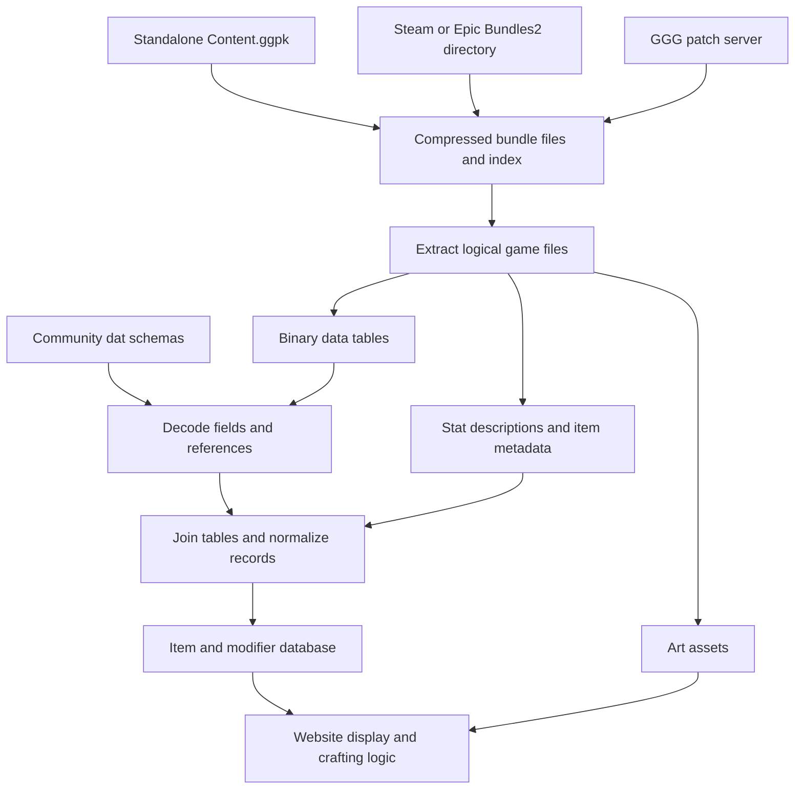

# Path of Exile game data extraction and website alignment

Researched 2026-10-02. Scope: primary documentation, extractor source code, public exports, live PoEDB/Craft of Exile views, and subsequent direct client-data extraction. The [implemented local pipeline](../../packages/poe-game-data/README.md) was verified with both games' CDN assets and saved raw-file replay. No installed `Content.ggpk` was available for a live archive test.

## Where the data comes from

Item bases, modifier definitions, tags, and many PoE 1 weights are client assets. They are extracted, decoded using community schemas, joined, and transformed for display. GGPK is the outer archive, not a ready-made item database. PoEDB's creator explicitly described mining the client and using `Mods.dat` in the original 2014 announcement. That establishes provenance, but does not establish the site's present production implementation. [PoEDB creator's announcement](https://www.pathofexile.com/forum/view-thread/1080552)

The archive/bundle distinction matters. `LibGGPK3` reads `Content.ggpk`; `LibBundle3` reads `Bundles2/*.bundle.bin` for Steam/Epic installations; `LibBundledGGPK3` combines both for the standalone client. [LibGGPK3 documentation](https://github.com/aianlinb/LibGGPK3)

For a concrete implementation, SnosMe's loader reads `Bundles2/_.index.bin`, resolves a logical file path to its bundle, offset, and size, then decompresses that slice. Its CDN loader uses the versioned `patch.poecdn.com` or `patch-poe2.poecdn.com` server. Thus a complete local GGPK is not required for this route. [Bundle loader source](https://github.com/SnosMe/poe-dat-viewer/blob/master/lib/src/bundles/load-util.ts)

## Tools and their separate responsibilities

| Tool | Role | Evidence and limitation |
| --- | --- | --- |
| LibGGPK3 / LibBundle3 / LibBundledGGPK3 | Read the archive and compressed bundle layers | C# libraries supporting PoE 1 and 2; this is not by itself a complete item/mod JSON exporter. [Repository](https://github.com/aianlinb/LibGGPK3) |
| libbun / libooz | Bundle extraction and Oodle decompression | Listed in PoEDB's extraction documentation; useful below the table-decoding layer. [PoEDB GGPK documentation](https://poedb.tw/us/GGPK) |
| SnosMe poe-dat-viewer | Inspect tables and investigate columns | Browser viewer supports PoE 1/2 `.datc64`, local upload, and patch-server import. [Repository](https://github.com/SnosMe/poe-dat-viewer) |
| `pathofexile-dat` | Programmatic/CLI export | SnosMe's companion library accepts a patch version or Steam directory; exports selected table columns and files, including stat descriptions; image conversion has an additional ImageMagick dependency. [Exporter documentation](https://github.com/SnosMe/poe-dat-viewer/blob/master/lib/README.md) |
| poe-tool-dev/dat-schema | Interpret binary columns and relationships | Community schema, expressed in GraphQL-like syntax and published as JSON. It supplies field types and foreign-table relationships; it is not the game data itself. [Schema documentation](https://github.com/poe-tool-dev/dat-schema) |
| Project-Path-of-Exile-Wiki/PyPoE | Python parsing, translation, and wiki exports | Maintained wiki fork; its documentation explains that specifications need updating as game files change. [Wiki fork](https://github.com/Project-Path-of-Exile-Wiki/PyPoE) |
| repoe-fork/RePoE | Produce convenient joined JSON | Uses PyPoE with specifications generated from poe-tool-dev's schemas. Hosts separate PoE 1/2 exports. [Repository](https://github.com/repoe-fork/repoe), [hosted export index](https://repoe-fork.github.io/) |

Older instructions and parsers refer to `.dat` or `.dat64`. Current SnosMe source explicitly accepts `.datc64` only; its export paths are `Data/<table>.datc64` for PoE 1 and `Data/Balance/<table>.datc64` for PoE 2. Treat the game, patch, file format, schema, and parser version as one compatible set. [DAT reader](https://github.com/SnosMe/poe-dat-viewer/blob/master/lib/src/dat/dat-file.ts), [table exporter](https://github.com/SnosMe/poe-dat-viewer/blob/master/lib/src/cli/export-tables.ts)

The binary format has a row count, fixed-size row data, and a variable-data section. The schema supplies column names and types. SnosMe's exporter calculates field offsets from that schema, reads columns, and emits JSON rows with `_index`. Foreign references still need resolving when building an application-level model. [DAT reader](https://github.com/SnosMe/poe-dat-viewer/blob/master/lib/src/dat/dat-file.ts), [table exporter](https://github.com/SnosMe/poe-dat-viewer/blob/master/lib/src/cli/export-tables.ts)

## Which source records produce the visible data

The following mapping is for PoE 1. Column names and layout can differ in PoE 2.

| Visible information | Source fields or assets |
| --- | --- |
| Base name, dimensions, drop level, item class | `BaseItemTypes`: `Id`, `Name`, `Width`, `Height`, `DropLevel`, `ItemClassesKey` |
| Base tags, implicit modifiers, domain | `BaseItemTypes`: `TagsKeys`, `Implicit_ModsKeys`, `ModDomain` |
| Modifier identity, prefix/suffix, level, exclusion families | `Mods`: `Id`, `Name`, `GenerationType`, `Level`, `Families`, `Domain` |
| Modifier values | `Mods.StatsKey*` references into `Stats`, with corresponding `Stat*Min` / `Stat*Max` |
| Spawn and generation weights | Parallel tag-reference and integer-value arrays in `Mods` |
| Crafting classification versus tags added to an item | `Mods.ImplicitTagsKeys` versus `Mods.TagsKeys` |

These names and references are declared in the community [PoE 1 core schema](https://github.com/poe-tool-dev/dat-schema/blob/main/dat-schema/_Core.gql).

Additional joins matter. RePoE's base exporter reads `ComponentAttributeRequirements`, `ArmourTypes`, `WeaponTypes`, `ShieldTypes`, and other component tables. It also adds inherited tags from item metadata and resolves the inventory image through `ItemVisualIdentity`. Reading `BaseItemTypes` alone therefore misses information needed for a complete base page or mod pool. [Base-item exporter source](https://github.com/repoe-fork/repoe/blob/master/RePoE/parser/modules/base_items.py)

RePoE's modifier exporter resolves stat references to string IDs and ranges, pairs each spawn-weight tag with its value, maps families to `groups`, and preserves `adds_tags` separately from `implicit_tags`. It generates displayed modifier text through PyPoE's translation machinery. That is a transformation of game records, not a direct serialization of every raw column. [Modifier exporter source](https://github.com/repoe-fork/repoe/blob/master/RePoE/parser/modules/mods.py)

Display text is another input: the extraction documentation includes `Metadata/StatDescriptions/stat_descriptions.txt`. The original RePoE documentation explains that stat translations turn stat IDs and values into the text shown on items. Do not expect `Stats.Id` alone to contain the final sentence. [File export documentation](https://github.com/SnosMe/poe-dat-viewer/blob/master/lib/README.md), [RePoE translation description](https://github.com/brather1ng/RePoE)

## What a weight means

PoE 1 spawn weights are ordered rules. Evaluate the entries in order and use the first tag present on the item; a matching zero blocks that modifier. Do not sum all matching tags. Generation weights are percentage multipliers on the selected spawn weight, with no adjustment when the array is empty. Existing mods can add tags, and normally spawnable mods sharing an exclusion group cannot coexist. [RePoE modifier semantics](https://github.com/repoe-fork/repoe/blob/master/RePoE/docs/mods.md)

For a single weighted selection from an already-correct eligible pool, the mathematical interpretation is `effective weight / sum of eligible effective weights`. That does not give the complete probability of crafting a finished item: the applicable method, modifier levels, item state, exclusions, and successive selections determine which pool applies. This distinction is an inference from the documented relative-weight and exclusion semantics, rather than a claim to have verified GGG's server implementation.

A live Craft of Exile example is `IncreasedLife1` (Healthy): `base_maximum_life` range 10–24, prefix, family `IncreasedLife`, minimum level 5. Its metadata shows ordered spawn tags `fishing_rod`, `weapon`, `default` with weights `0`, `0`, `1000`, and empty generation-weight arrays. A weapon matches zero before reaching `default`; an ordinary belt reaches `default`. In the linked search results, select the exact `IncreasedLife1` row to open its metadata dialog. [Craft of Exile modifier lookup](https://beta.craftofexile.com/data?mode=mods&dataModSearchInput=IncreasedLife1)

## How this aligns with PoEDB and Craft of Exile

PoEDB documents the archive/table/schema/export distinction and links the tools above. Its separate historical extraction notes describe Steam manifests via DepotDownloader, GGPK/bundle unpacking using libooz/libbun, content hashes, Brotli storage, and a SQL file index. These are published technical notes, not proof that every detail remains in its current deployment. [GGPK documentation](https://poedb.tw/us/GGPK), [DepotDownloader notes](https://poedb.tw/us/DepotDownloader)

Craft of Exile's current beta About page directly credits SnosMe's `pathofexile-dat` viewer and extractor. That is stronger evidence for its extraction tooling than assuming it scrapes PoEDB or consumes RePoE. It also credits poe.ninja for market prices, demonstrating that prices are a separate source. [Craft of Exile credits](https://beta.craftofexile.com/about)

One checked example matches across the public export and both websites:

| Leather Belt field | RePoE JSON | PoEDB | Craft of Exile metadata |
| --- | --- | --- | --- |
| Base key | `Metadata/Items/Belts/Belt3` | Same metadata path | Same key |
| Drop level | 10 | 10 | 10 |
| Dimensions | 2 × 1 | 2 × 1 | `[2, 1]` |
| Tags | `belt`, `default` | `belt`, `default` | Resolved tag references to `belt`, `default` |
| Implicit | `IncreasedLifeImplicitBelt1` | Displays +25–40 maximum life | Same implicit key; displays +25–40 maximum life |
| Inventory art | `Art/2DItems/Belts/Belt3.dds` | Same asset | Same asset stem |

Sources: [RePoE Belt export](https://repoe-fork.github.io/base_items/Belt.json), [PoEDB Leather Belt](https://poedb.tw/us/Leather_Belt), [Craft of Exile item lookup](https://beta.craftofexile.com/data?mode=items&dataItemSearchInput=Leather+Belt) (open Metadata).

This establishes agreement for the checked record, not that the sites share an importer. Use metadata paths and modifier keys when comparing sources; localized names and website-specific numeric IDs are weaker join keys. Compare matching patch versions before attributing differences to bugs.

## PoE 2 weights require a separate provenance check

Craft of Exile's published PoE 2 weighting page says its weights were derived using recombinators. For bases that cannot be recombined, it describes trade-listing samples and normalization, and acknowledges selection bias and uncertainty. Its About page credits Krakenbul and the Prohibited Library for PoE 2 weighting data. Those values should not automatically be described as exact client-extracted weights. [Weighting methodology](https://www.craftofexile.com/weightings?game=poe2), [credits](https://beta.craftofexile.com/about)

There is a current-source discrepancy worth preserving: today's PoE 2 community schema labels an old field as formerly `SpawnWeight_Values`, but also contains a newer `SpawnWeight_Values` field at the end of `Mods`. The current RePoE PoE 2 exporter reads that named field. A schema field and exporter reference do not establish that the values are populated, accurate server probabilities, or used by Craft of Exile. [PoE 2 schema](https://github.com/poe-tool-dev/dat-schema/blob/main/dat-schema/poe2/_Core.gql), [PoE 2 modifier exporter](https://github.com/repoe-fork/repoe/blob/master/RePoE/parser/poe2/mods.py)

The hosted PoE 2 export index initially identified version `4.5.5.2`. Subsequent direct extraction in this repository resolved current build `4.5.5.4` through GGG's patch protocol and decoded its modifiers. All 17,058 extracted spawn-weight entries were 0 (9,125) or 1 (7,933); there were no other values. These client values therefore do not provide unequal relative weights among eligible modifiers. Preserve them as client data without representing them as Craft of Exile's empirical weights. The [pipeline guide](../../packages/poe-game-data/README.md) records the run and reproduction commands. [Hosted export index](https://repoe-fork.github.io/poe2/), [patch protocol implementation](https://github.com/aianlinb/LibGGPK3/blob/master/LibGGPK3/PatchClient.cs)

## Practical choice for this repository

The local implementation now uses TypeScript and shared Zod schemas, with `pathofexile-dat` 15.2.0 for bundle/DAT decoding, `ooz-wasm` for decompression, and `@imagemagick/magick-wasm` for PNG/WebP output. Read-only GGPK access, schema-based joins, inherited item tags, English stat translation, and snapshot management are implemented in this package. It saves the raw consumed files, schema, normalized data, exact TypeScript sources, package metadata, workspace dependency lock, and SHA-256 manifest. Python and native ImageMagick are no longer runtime requirements. [SnosMe exporter](https://github.com/SnosMe/poe-dat-viewer/blob/master/lib/README.md), [ImageMagick WASM](https://github.com/dlemstra/magick-wasm), [pipeline guide](../../packages/poe-game-data/README.md)

The former RePoE/PyPoE pipeline supplied saved client snapshots for a full-record compatibility comparison. The TypeScript exporter keeps its JSON contract while correcting the six-stat text limit, PoE 2 gold-price join, and signed Ultimatum lookup. PoE 2 `.csd` descriptions are UTF-16LE text at `Data/StatDescriptions`, so the same English translation parser handles both games. The original implementation is useful as a reference, not a runtime subprocess. [RePoE modifier exporter](https://github.com/repoe-fork/repoe/blob/1c72e40a99aa8c8f70e9a3526155f455d5eedd43/RePoE/parser/modules/mods.py), [PyPoE translation semantics](https://github.com/repoe-fork/pypoe/blob/66d1d7442c5718260e1a8efd24989d22987e91af/PyPoE/poe/file/translations.py)

TypeScript makes the normalization and validation layer directly usable alongside this repository's application schemas. The codec work remains in maintained WASM dependencies. A Rust port would be most useful for a measured binary-reader or decompression bottleneck; porting the entire pipeline would add a second application schema/tooling stack without a demonstrated benefit here.

Keep provenance with the imported data: game, patch/manifest, extractor version, schema revision, source path, and whether a weight was extracted or estimated. Preserve ordered weight arrays and the raw modifier IDs. The implementation's PoE 1 `3.29.3.3` extraction reproduced the Leather Belt and `IncreasedLife1` values compared above. Its fixture suite checks that weight-selection behavior; this is a sample alignment check, not proof that all site data or crafting algorithms match.

Do not build against an assumed Craft of Exile data API: its developer page currently documents item import by URL and explicitly says there are no API endpoints. [Developer integration documentation](https://beta.craftofexile.com/developers)
