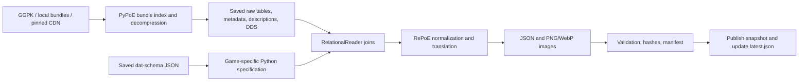

# Local game-data pipeline

Extract PoE 1 and PoE 2 client assets into separate, versioned datasets of item bases, modifiers, ordered weight rules, stats, tags, item classes, English modifier text, and inventory images. Inputs can be a local installation (`Content.ggpk` or `Bundles2`), previously extracted raw files, or GGG's patch CDN. No account, game API credentials, or website scraping is needed.

The pipeline uses commit-pinned [RePoE](https://github.com/repoe-fork/repoe) and its compatible [PyPoE fork](https://github.com/repoe-fork/pypoe). Their Python dependencies are locked in `uv.lock`. This fork matters: the original PyPoE and the wiki fork have different schemas and interfaces. The [research report](../../docs/research/poe-game-data-extraction.md) documents other tools and the evidence for PoEDB/Craft of Exile's data sources.

## Run it

Install [Vite+](https://viteplus.dev/guide/) and [uv](https://docs.astral.sh/uv/getting-started/installation/). `uv` creates the package's `.venv` and obtains Python 3.13 when needed. Dependency installation uses the network; the tests themselves do not. Windows was used for the live verification below; Linux CI runs the fixture suite.

From the repository root:

```sh
vp install --frozen-lockfile
vp run @poe-tools/game-data#test
vp run @poe-tools/game-data#extract versions
vp run @poe-tools/game-data#extract run --config pipeline.example.json
```

Vite+ runs this package's scripts from `packages/poe-game-data`, so the config and default `data/` output paths above are relative to that directory. All subsequent commands use that same convention. `versions` performs a read-only handshake directly with GGG's patch servers; copy its JSON into your config before a new extraction. The example pins the versions verified on 2026-10-02, not a permanent “latest” alias. Old CDN versions can disappear.

To extract one game, append `--game poe1` or `--game poe2`. The default processes every game in the config, in order. A failure stops the command; any game already completed keeps its successful snapshot. To retry the other game, select it explicitly.

Each run prints its staging directory. Progress and upstream warnings are written to that directory's `extract.log`. The first run downloads bundles on demand and can use several gigabytes of disk and memory; repeated runs reuse the per-game, per-patch bundle cache. It does not download the entire game.

## Use an installed game

Create `pipeline.local.json` in this package:

```json
{
    "poe1": {
        "patch": "3.29.3.3",
        "directory": "F:/Games/Path of Exile"
    },
    "poe2": {
        "patch": "4.5.5.4",
        "directory": "F:/Games/Path of Exile 2"
    }
}
```

```sh
vp run @poe-tools/game-data#extract run --config pipeline.local.json
```

Use the installation root containing `Content.ggpk` or `Bundles2/_.index.bin`, not the archive filename or `Bundles2` itself. Paths may be absolute or relative to the config file. An unpacked directory with logical `Data`, `Metadata`, and `Art` paths also works. PyPoE reads the archive and bundles without modifying them. Keep the patcher closed during a local run so the inputs stay consistent.

For local sources, `patch` is a label supplied by you, not a version independently verified from the archive. Use the full client build/CDN version from the game's log, which may differ from the public patch name. Do not label an older installation using the current online version.

The default schema is downloaded from [poe-tool-dev/dat-schema's latest release](https://github.com/poe-tool-dev/dat-schema/releases). To match an older installation or reuse a known schema, supply `--schema path/to/schema.json`. A schema is community reverse-engineered information, not an official GGG database specification.

## What happens



1. Resolve a local source or the configured game's versioned CDN URL. CDN bundles are cached beneath `.cache/bundles/<game>/<patch>/`. The wrapper uses URL paths consistently on Windows and records the compressed files' hashes in `transport.json`.
2. Download or read the schema. Generate separate PoE 1/2 specifications through PyPoE's `import_dat_schema`, including upstream compatibility aliases and virtual fields. The specifications are saved in the snapshot, without modifying the installed library.
3. Decode `Data/*.datc64` for PoE 1 and `Data/Balance/*.datc64` for PoE 2. PyPoE resolves foreign-table references. Every consumed logical file is preserved under `raw/` with its SHA-256 and byte size in `inputs.json`.
4. Run RePoE's tags, stats, mods, bases, and item-class exporters. The shared stats exporter is compatible with both generated specifications. Base extraction includes component requirements/properties and inherited metadata tags; modifier extraction includes stat-description translation. DDS assets become PNG and WebP. English is the current output language.
5. Preserve the raw `Mods.MaxLevel` as the additional `maximum_level` field. Check both weight-array pair lengths, schema row sizes, foreign references, normalized models, implicit/mod/stat references, and numeric ranges. Missing text and images are reported in `validation.json`; they are not replaced with fabricated values. Upstream translation warnings remain in the log.
6. Hash snapshot files and publish only after validation succeeds. A temporary directory is renamed to its final name, then the game's `latest.json` pointer is replaced atomically. Failed runs retain `.incomplete-*` and their logs without replacing the previous successful pointer. Publication is independent for each game.

The client contains unused, legacy, monster, unique, and other non-crafting records. Dataset counts are not counts of currently obtainable items or ordinarily rollable modifiers. RePoE also applies curated interpretation, including release-state lists and some domain corrections; `raw/` is the source evidence for those transformations.

## Outputs and inspection

```text
data/<game>/
  latest.json                         # relative path to the last successful snapshot
  snapshots/<patch>-<run-id>/
    manifest.json                     # game, source, patch label, dependency pins, file hashes
    source.json
    schema.json / schema.py
    uv.lock / pipeline.py             # dependency lock and wrapper source at invocation
    inputs.json / transport.json
    validation.json / extract.log
    raw/Data/...                      # binary tables, including referenced tables
    raw/Metadata/...                  # .it files, stat descriptions and includes
    raw/Art/...                       # consumed source art
    normalized/base_items.json
    normalized/mods.json
    normalized/stats.json
    normalized/tags.json
    normalized/item_classes.json
    normalized/Art/...                # PNG and WebP
```

RePoE additionally emits compact `.min.json` variants, per-class bases, tag details, and parsed item metadata. Use metadata paths for base keys and raw modifier IDs for mod keys. Paths in `visual_identity.dds_file` identify the source DDS; replace `.dds` with `.png` or `.webp` under `normalized/` for display.

Use the actual snapshot path printed by the run, or resolve `latest.json`. For example, in PowerShell:

```powershell
$pointer = Get-Content packages/poe-game-data/data/poe1/latest.json | ConvertFrom-Json
$snapshot = "data/poe1/$($pointer.snapshot)"
vp run @poe-tools/game-data#extract verify --snapshot $snapshot
vp run @poe-tools/game-data#extract inspect --snapshot $snapshot --base Metadata/Items/Belts/Belt3 --item-level 85
```

`verify` checks recorded SHA-256 hashes and normalized relationships. These hashes detect changes against the local manifest; they are not signatures authenticating the client or schema publisher. `extract.log` is excluded from hashing. `inspect` returns the base plus candidate prefixes/suffixes and their selected client weights. Add `--existing <mod-id>` repeatedly to incorporate added tags and exclusion groups.

Candidate selection respects domain, minimum/maximum level, essence-only status, groups, and ordered tag rules. The first matching spawn tag wins, including zero; the first matching generation weight is a percentage multiplier, defaulting to 100. No matching spawn rule means zero. This is a diagnostic candidate list, not a full crafting simulator: it does not implement rarity/affix caps, influences, fossils, bench recipes, omens, or complete method-specific probabilities.

**PoE 2 client values must not be treated as relative crafting probabilities.** In the verified `4.5.5.4` extraction, all 17,058 spawn-weight entries were either 0 (9,125 entries) or 1 (7,933 entries). These values distinguish eligibility but provide no unequal weighting among eligible mods. The output preserves those values and labels their provenance; it does not substitute Craft of Exile's [empirical weight estimates](https://www.craftofexile.com/weightings?game=poe2). PoE 1's extracted relative weights likewise do not by themselves implement a complete server crafting method.

## Reproduce an extraction offline

```sh
vp run @poe-tools/game-data#extract replay --snapshot data/poe1/snapshots/<patch>-<run-id>
```

Replay first verifies the original snapshot and checks that the current dependency lock matches. It then extracts from the saved `raw/` directory with the saved schema into a new snapshot. The extraction stage makes no network requests. The initial `uv run --locked` may still need network access if its locked Python environment is not installed; use an already synchronized environment for offline operation. Use the same repository revision for the same wrapper behavior. On Windows, PyPoE's application data is kept within this package's `.cache/appdata`.

To recover from a failed run, read its log, correct the source/schema/dependency incompatibility, and rerun. Do not promote a partial directory manually. A CDN 404 can mean the patch has been retired; run `versions` and create a new pinned config, or use a preserved installation/raw snapshot. The pipeline does not silently switch versions during an extraction. A failed schema/reference check needs investigation rather than a guessed field mapping.

Keep `data/` for as long as you need its provenance and replay inputs. `.cache/` is disposable download/runtime cache; clearing it causes downloads again. Both it and `.venv/` are ignored by Git, as is `pipeline.local.json`. Generated game data is not committed or published by this package.

## Verified results and website alignment

Live GGG CDN extraction on 2026-10-02 produced:

| Game / client build | Bases | Mods | Stats | Tags | Mods without rendered text | Missing base PNGs |
| --- | ---: | ---: | ---: | ---: | ---: | ---: |
| PoE 1 / `3.29.3.3` | 5,461 | 40,355 | 23,346 | 1,389 | 3,952 | 0 |
| PoE 2 / `4.5.5.4` | 5,496 | 16,784 | 27,281 | 1,339 | 3,420 | 0 |

The Leather Belt extracted locally has ID `Metadata/Items/Belts/Belt3`, drop level 10, dimensions 2×1, tags `belt/default`, and implicit `IncreasedLifeImplicitBelt1` (+25–40 life), matching the record checked on [PoEDB](https://poedb.tw/us/Leather_Belt) and [Craft of Exile](https://beta.craftofexile.com/data?mode=items&dataItemSearchInput=Leather+Belt). Locally extracted `IncreasedLife1` has level 5, range 10–24 life, and ordered weights `fishing_rod:0`, `weapon:0`, `default:1000`, matching the [CoE metadata example](https://beta.craftofexile.com/data?mode=mods&dataModSearchInput=IncreasedLife1). A fixture tests that selection behavior. These comparisons establish agreement for those records, not full-site equivalence.

PoE 2's `IncreasedLife1` instead has level 1, range 10–19 life, and eligible item-class weights of 1. It must remain in the separate PoE 2 namespace. The stale `4.5.5.2` returned by the third-party version service was unavailable at GGG during verification; the direct patch handshake resolved `4.5.5.4`.

The live checks exercised CDN extraction and local raw-file replay for both games. Every normalized file from each replay had the same SHA-256 as its CDN extraction. No installed game or real `Content.ggpk` was supplied for a live archive test. Synthetic GGPK fixtures verify UTF-16 and UTF-32 filenames, direct archive-file reads, raw-byte recording, and leaving the archive unchanged. The wrapper normalizes PyPoE's stream return value for unbundled GGPK records. The 13-test suite also covers weight ordering/filtering, schema/model and relationship validation, patch protocol fragmentation, safe paths, checksums, separate game manifests, and preserving the last successful snapshot on failure.

## Dependency maintenance

The two extractor archives are pinned to immutable Git commits, with archive hashes in `uv.lock`. To update RePoE, use `vp exec --filter @poe-tools/game-data uv add "repoe @ https://github.com/repoe-fork/repoe/archive/<commit>.tar.gz"`. The compatible PyPoE commit is an override in `pyproject.toml`; update that override together with RePoE, then run `vp exec --filter @poe-tools/game-data uv lock`. Review and commit both the project and lock changes. Do not edit the installed `.venv` as a fix.

Run the package tests, extract both current patches, and check logs, counts, row sizes, references, and sample website records after any dependency/schema update. `vp run ready` includes the package tests. CI installs uv and runs them separately from Vitest, without downloading game data.

The patch handshake follows [LibGGPK3's protocol implementation](https://github.com/aianlinb/LibGGPK3/blob/master/LibGGPK3/PatchClient.cs): protocol 6, opcode 1 request, opcode 2 response, big-endian URL character count, UTF-16LE URL. The wrapper handles fragmented TCP responses and checks the expected game's CDN host.
