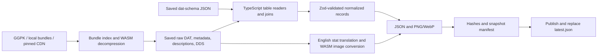

# Local game-data pipeline

Extract PoE 1 and PoE 2 client assets into separate, versioned datasets of item bases, modifiers, ordered weight rules, stats, tags, item classes, English modifier text, and PNG/WebP inventory images. Inputs can be an installed game (`Content.ggpk` or `Bundles2`), previously extracted raw files, or GGG's patch CDN. No account or website scraping is needed.

The implementation is TypeScript with shared Zod schemas. It uses `pathofexile-dat` for bundle/DAT decoding, its `ooz-wasm` dependency for decompression, and `@imagemagick/magick-wasm` for images. GGPK access, joins, item metadata, stat-description translation, validation, and snapshot management live in this package. Python, uv, native compiler toolchains, and an external ImageMagick installation are no longer required.

The [research report](../../docs/research/poe-game-data-extraction.md) explains GGPK, the extraction tools, and the evidence for PoEDB and Craft of Exile's data sources. The JSON contract and curated release states follow [RePoE](https://github.com/repoe-fork/repoe); see [third-party notices](THIRD_PARTY_NOTICES.md).

## Run it

Install [Vite+](https://viteplus.dev/guide/) and the Node version in `.node-version` (Node 24). From the repository root:

```sh
vp install --frozen-lockfile
vp run @poe-tools/game-data#test
vp run @poe-tools/game-data#extract versions
vp run @poe-tools/game-data#extract run --config pipeline.example.json
```

Use `--help` on any command or add `--interactive` to enter omitted values with Clack. Explicit flags remain suitable for automation; `--no-interactive` disables prompts. See [repository CLI conventions](../poe-cli/README.md).

Vite+ runs this package's scripts from `packages/poe-game-data`, so command paths and the default `data/` output are relative to that directory. `versions` performs a read-only handshake with GGG's patch servers. Copy its result into a config before a new extraction. The example pins the builds verified on 2026-10-02; old CDN versions can disappear.

Append `--game poe1` or `--game poe2` to select one game. The default processes every configured game, in order. After extraction succeeds for all selected games, `run` updates their tracked data packages. A failure stops the command; a game already published keeps its snapshot. Progress goes to stderr; snapshot paths and package results are JSON on stdout. Bundles download on demand and are cached by game and patch under `.cache/bundles/`. Allow several gigabytes of disk space for cached bundles, raw assets, and images.

## Use an installed game or saved raw files

Create ignored `pipeline.local.json` in this package:

```json
{
    "poe1": { "patch": "3.29.3.3", "directory": "F:/Games/Path of Exile" },
    "poe2": { "patch": "4.5.5.4", "directory": "F:/Games/Path of Exile 2" }
}
```

```sh
vp run @poe-tools/game-data#extract run --config pipeline.local.json
```

Use the installation root containing `Content.ggpk` or `Bundles2/_.index.bin`, not the archive filename or `Bundles2` directory itself. An unpacked directory with logical `Data`, `Metadata`, and `Art` paths also works. Directory paths resolve relative to the config file. The source is read-only; keep the patcher closed during extraction so inputs remain consistent.

For local sources, `patch` is your label, not a version verified from the archive. Use the full client build/CDN version from the game's log, which can differ from the public patch name.

The default schema downloads from [poe-tool-dev/dat-schema's latest release](https://github.com/poe-tool-dev/dat-schema/releases). To match an older client or work offline, supply `--schema path/to/schema.json`. The schema is a community interpretation of binary records. A row-size mismatch stops extraction rather than guessing offsets. Schema formats 7 and 8 are supported; a newer format needs an explicit compatibility review.

## Crafting data for both games

Canonical base properties retain `reload_time` in integer milliseconds from PoE 2 `WeaponTypes.ReloadTime`, using the table's `BaseItemType` reference. Positive values occur on 33 crossbows in the pinned build; zero remains zero, including Trarthan Cannon, and bases without a weapon row remain null. PoE 1 exports null because its weapon table has no reload-time column. The shared Zod schema and generated package JSON schemas accept nonnegative integers or null. Full snapshots retain and hash the raw weapon table; the browser catalog projects this same property for its local reload calculation. No third-party base values are imported.

`allflame` retains all 293 PoE 1 currency brackets, 45 item-class cost rules and 100 item-level cost factors from `DeepwaterCraftingCurrencies`, `DeepwaterCraftingClasses` and `DeepwaterBalancePerLevel`. Costs use the named `Cost` column. The unnamed class and level values remain integer percentages; the application must divide by 100 when applying them. Currency brackets retain their extracted tier, outcome-count interval and intangibility interval. Item levels use the stored foreign-key values, not row positions. The sulphur identity resolves through `KeywordPopups.ItemReference`, `KeywordPopupItemReference.BaseItemType` and `BaseItemTypes`. Client help and keyword definitions retain the corruption and imprint restrictions. Validation checks references, duplicate classes/brackets/tiers, complete level coverage, ordered intervals and all nine source-table hashes. PoE 2 exports `null`. Unresolved currency columns are not assigned semantics; this extraction does not itself implement Allflame choice generation or selection.

`strongboxes` joins `Strongboxes.ChestsKey` to `Chests`, retaining all 52 PoE 1 and 50 PoE 2 records in the pinned builds. Names, metadata parents, tags, fixed modifiers, base references, level ranges, encounter weights and spawn-stat relationships come from those tables. `SpawnWeightIncrease` is a nullable `Stats` reference, not a numeric weight; PoE 2's required and blocking spawn stats are arrays. Validation checks unique chest IDs, levels, modifier/base/tag references and hashed `Strongboxes`, `Chests`, `Mods`, `Tags` and `Stats` provenance. Every extracted Strongbox currently has a null inventory-base reference. Encounter weights are never used as modifier weights.

The browser currently exposes 19 ordinary PoE 1 and 25 PoE 2 variants through an explicit supported-operation rule. Special/unique, expedition, landmark, Abyss and hardmode variants remain in the supplement for further work. Display names, tags, modifiers, levels and currency identities are not duplicated in that rule. `Strongbox` is an application category; these records are not inserted into `BaseItemTypes` or `ItemClasses`. The browser supplies the default weight fallback and each game's modifier domain as operation semantics. Fixed encounter modifiers remain separate from craftable affixes.

PoE 1 Talisman beastcrafts derive their operation from `BestiaryRecipes` and its category text. The normalized `talismanCraft` field identifies rare-Talisman imprinting or the extracted fracture count and minimum modifier count. The build supplies one-fracture/four-modifier and two-fracture/six-modifier recipes and their influence/fracture exclusions. Validation rederives these fields, resolves the `talisman` tag and requires recipe/category provenance. PoE 2 has no such recipes. Random fracture selection remains a separate application model.

PoE 1 beast augmentation recipes also derive from the extracted category and description. Their normalized `augmentation` field identifies a required influence enum or item class. Validation rederives all seven rules, checks the influence/class references, and requires recipe/category provenance. Recipe IDs, descriptions and component identities remain build records; the application models their ordinary weighted modifier addition at item level.

The random metamod beast recipe resolves a `metamods` array through the five crafting-rule stats in extracted `Mods`. Extraction requires one crafted prefix or suffix record per stat, and validation requires every outcome to have a bench recipe with item-class restrictions plus beast/category/bench table hashes. Modifier IDs, text, sides, values, groups and compatible classes are build-derived. Selecting these five rule stats as the metamod family and assigning equal chances are modeled operation semantics; no third-party modifier records are imported.

PoE 2 quality Infusers resolve four currency actions into `qualityInfusers`: eligible item classes, base or catalyst quality, and the additional maximum quality parsed from each currency description. Class restrictions use extracted base tags or the explicit classes in the currency instructions. Validation rederives these records, rejecting missing recipes, unresolved classes, altered limits and unsupported descriptions. The existing hashed `CurrencyItems` and `BaseItemTypes` inputs supply these records; PoE 1 exports an empty list. Per-use increments and corruption chances remain application models, not extracted probabilities.

PoE 2 Waystone relationships come from `Maps.BaseItemType`, `Maps.Tier` and `Maps.MapSeries`, joined to `MapTiers.Level`. The supplement exposes 16 records with base IDs, tiers, series and area levels; names and item drop levels are not used to infer tiers. Both raw tables have source hashes. Validation rejects unresolved bases, duplicate base or series/tier entries, missing Waystone records, invalid levels and absent table provenance. PoE 1 exports an empty Waystone list. Corruption outcome probabilities and affix-cap changes remain application models.

PoE 1 map records come from `Maps.BaseItemTypesKey`, `Tier`, `MapGeneration` and `MapUpgrade_BaseItemTypesKey`. Area levels use `Shaped_AreaLevel` when present, otherwise `Regular_WorldAreasKey.AreaLevel`; this preserves legacy map areas whose levels differ from current tier conventions. All 491 map records are retained, including the two zero-tier records. `Maps` and `WorldAreas` have source hashes, and validation rejects missing or duplicate maps, unresolved upgrades, invalid levels and absent provenance. PoE 2 exports an empty map list. The crafting catalog has 486 modifiable map bases; the five tier-17 bases remain excluded by their extracted restrictions.

PoE 1 map corruption beast operations derive from the retained `BestiaryRecipes.Description` and category text. The current build repurposes `EinharMasterCraft28` as guaranteed map corruption implicit crafting; the old 30%-quality equipment interpretation is not used. The normalized `mapCorruption` field distinguishes implicit and twice-corruption recipes, and validation rejects inconsistent values or unknown descriptions. Area-domain corrupted modifiers export general item descriptions for stats hidden by the map display context, retaining all 13 map corruption descriptions and source hashes without changing ordinary area translation.

PoE 2 temple corruption eligibility comes from `Incursion2CorruptionCurrencies.BaseItemType` and `ItemClasses`. All three currencies retain their class references. `ClientStrings` supplies `ItemPopupDoubleCorrupted` and `ItemErrorAlreadyIncursionCorrupted`, preserving the item label and repeated-use restriction. Both raw tables are hashed; validation rejects unresolved or duplicate currency/class references, missing action records and absent provenance. PoE 1 exports `templeCorruption: null`. Branch probabilities and implicit replacement behavior remain application models.

PoE 1 Locus eligibility comes from `ItemClasses.CanBeDoubleCorrupted`. `IncursionRooms` supplies the `CorruptionRoomIII` identity, name, room tier and description. Both raw tables are hashed, and validation requires their provenance for a non-null Locus record. PoE 2 exports a null record and false class flags. Corruption branch probabilities and implicit replacement behavior remain separate application models.

Every new extraction snapshot includes `crafting-data.json`. It contains currency actions, base and item-class restrictions, rarity limits, modifier restrictions, essence guarantees and weights, and stat-description rules for displaying rolled values. PoE 1 also includes bench costs, influence upgrades, fossils, Harvest commands and bestiary recipes. PoE 2 includes tiered currency floors, craftable modifier types and all 26 Liquid Emotion jewel recipes. `LiquidEmotionOutcomes` colour columns and the radius flag resolve to unique extracted Jewel bases; modifier references and affix sides are validated. This table contains no outcome weights.

Anointing and instilling records come from the three `BlightCrafting*` item, recipe and result tables, `PassiveSkills`, and PoE 1's `BlightCraftingTypes`. Ingredient order, unresolved outcomes, passive graph hashes and raw stats are preserved. Passive descriptions use the extracted `passive_skill_stat_descriptions` file and its includes. The supplement contains 576 PoE 1 recipes and 1,017 PoE 2 recipes; 142 PoE 2 records have no resolved outcome.

PoE 1 anointing also includes the two fixed Blighted Map modifiers. Their stats identify the map type and their translated descriptions provide the maximum anointment counts. The 13 map oil recipes retain their fixed modifier effects and ingredient references. Validation checks these rules against the hashed modifier data and requires recipe table provenance; the browser exporter explicitly includes the intrinsic map modifiers.

PoE 2 socketable augments come from `SoulCores`, `SoulCoreStats`, `SoulCoreLimits`, `SoulCoreTypes`, `SoulCoreStatCategories` and `ClientStrings2`. All 313 augment records and 526 effect rows retain names, required levels, type/count/effect stats, limits, higher tiers, socket binding and item restrictions. Ordinary and bonded stats are separate fixed-value lists with build-extracted text and description references; empty and bonded-only records are preserved. Generic martial and armour scopes resolve through the extracted base tags. `Expedition2WarpingRuneStatToTag` supplies the six Warping rune stat-to-tag mappings. Both games also export referenced tagged modifier magnitude rules from `ModEffectStats`, including their explicit/implicit and affix-side restrictions. Stat-scaling flags include both modifier and augment stats through the same normalization path for full and supplemental extraction. PoE 1 exports no augments. Runtime socketing, crafting transformations and character-dependent bonuses remain application rules.

PoE 2 `baseRules.initialSockets` reads the pinned `BaseItemTypes` schema's unnamed scalar `i32` at zero-based column 30. The reader rejects named, array, interval or differently typed columns. The four nonzero records are Corona Amulet, Grasping Ring and Stalking Belt (one each), and Runemastered Spiritbone Crown (three). Validation requires the base table hash and a matching native socket-count or socketable-class implicit. PoE 1 exports zero. Browser catalogs also retain the existing inventory dimensions; the application combines this count with native `local_has_X_sockets` implicits, including the five Kalguuran Forgehammer bases. Socket-class behavior and corruption limits are documented application rules, while counts, dimensions, implicit stats and augment restrictions remain build records.

PoE 2 also resolves the default `PassiveSkillTrees` record to its client `.psg` asset. A bounded version-3 parser extracts node membership, rejecting truncated data, unsupported headers, duplicate nodes and trailing bytes. The supplement retains 1,297 named notables with graph hashes, stats, descriptions and ascendancy restrictions; 942 have neither an ascendancy nor an ascendancy visibility restriction. The graph and supporting tables have source hashes. These records support existing allocated-passive item payloads; graph membership does not establish an Essence of Delirium outcome pool or weights. Full extraction and supplemental extraction use the same passive translation and lookup export.

Harvest `add_enchant_to_class` commands resolve to explicit item-class lists and modifier references. The 14 quality enchantments retain their original command parameters and costs, validate every referenced class and modifier, and include their modifiers in the crafting browser export.

PoE 1 bench recipes retain `CraftingBenchOptions.Sockets` as a nullable socket count and `Links` as a nullable linked-socket count. Five active recipes set two through six sockets with extracted Jeweller's Orb costs; another five set two through six linked sockets for 1, 3, 5, 150 and 1,500 Fusings. Item-class categories are retained. Validation checks ranges, mutually exclusive recipe effects, matching currency actions and link-recipe table provenance. The existing raw table hash covers these fields. The runtime models the corrupted-item Vaal surcharge from these costs and the extracted corruption currency; the client table does not contain the surcharge formula. Link guarantees are implemented; remaining-link and colour distributions are unresolved.

PoE 1 flask enchantments retain the `CraftingBenchOptions.AddEnchantment` reference and its explicit target classes separately from the bench's broader display categories. Fifteen Instilling recipes carry their extracted costs. Currency actions resolve to the `Mods` Instilling/Enkindling generation types and the utility-flask classes named by the currency instructions; all 21 modifier records are retained, including a zero-weight legacy record that cannot roll. Validation recomputes these pools and rejects missing or mismatched recipe references. `CurrencyItems`, `ItemClasses`, `Mods` and `CraftingBenchOptions` retain raw-file provenance. Runtime rolls use the extracted ordered weights and stat ranges; this is a client-weight model, not a measurement of server probabilities.

Harvest `reroll_with_current_tags_affinity_multiplier` parameters normalize from signed percentages into positive weight multipliers. The pinned build supplies 10× for more-likely reforges and 0.1× for less-likely reforges. Invalid or missing percentages fail extraction; the original command and parameter remain available alongside the normalized value.

Harvest `reroll_influence_types` parameters normalize into 24 eligible item classes. Class references and the normalized list are validated against the retained command. Candidate influence types still come from `InfluenceTags`, and lifeforce costs come from the recipe; extraction does not supply the server's selection distribution or rarity-transition behavior.

PoE 2 `KeywordPopups` supplies the Sanctified, Desecrated Modifiers and Mark of the Abyssal Lord definitions. Sanctification's 78–122% range is parsed from that pinned client definition and validated against the retained source text. Missing or unrecognized definitions fail validation. The Abyss mark definition describes a higher tier but does not provide its numeric floor; extraction does not invent that value.

To expand the existing packages without repeating image extraction, run these commands from the repository root:

```sh
vp run @poe-tools/game-data#extract crafting-data --game both
vp run @poe-tools/game-data#extract verify-packages --game both
vp run poe-boats#game-data:crafting
```

The supplemental extraction uses each package's pinned client build and requires the same DAT schema hash. `--source` and `--schema` support local inputs. The package manifest records the supplement's SHA-256; the supplement records base, modifier, schema and consumed raw-file hashes. Snapshot verification also checks those raw-file references. App builds verify these inputs before generating their browser catalogs.

Base-quality currency definitions include their maximum quality, corruption requirement and eligible item classes. Currency instructions resolve armour, weapon and flask categories against extracted base tags, or explicitly name caster weapon classes. Maximum quality comes from the currency instructions or PoE 2's `Quality` keyword. Validation recomputes the definitions against the build; unknown target text or missing limits fail extraction. Per-use increments and tainted roll distributions remain separately labeled application models.

Crafting catalogs select bases using extracted metadata and restrictions. They do not use the older curated `release_state` field, which remains part of the existing general dataset contract. Client files include legacy and unused records; presence in the catalog is not a claim about current league availability. No third-party game dataset is fetched by the workbench. See [crafting coverage and remaining work](../../docs/crafting-implementation.md) for modeled server rules and accuracy limits.

## Architecture



| Module | Responsibility |
| --- | --- |
| `config.ts`, `versions.ts` | Validate game/build selection; discover versions via the patch protocol |
| `ggpk.ts`, `source.ts` | Read GGPK, resolve bundle slices, cache downloads, record input hashes |
| `dat-reader.ts`, `tables.ts` | Decode DAT columns, enforce row sizes, resolve foreign keys |
| `metadata.ts`, `normalize.ts` | Inherit item tags; join bases, requirements, properties, classes, modifiers, and stats |
| `translations.ts` | Parse English descriptions, includes, conditions, numeric handlers, and relational values |
| `images.ts` | Resolve DDS aliases/Brotli, export PNG/WebP, compose PoE 2 flask icons |
| `json-schema.ts` | Generate Draft 2020-12 schemas from the canonical Zod output schemas |
| `model.ts` | Canonical Zod data contract, relationship validation, diagnostic mod pools |
| `pipeline.ts`, `cli.ts`, `distribute.ts` | Record provenance, publish, verify, replay, inspect, generate packages, and optionally commit |

PoE 1 tables live at `Data/*.datc64`; PoE 2 uses `Data/Balance/*.datc64`. PoE 1 stat descriptions are `Metadata/StatDescriptions/*.txt`. PoE 2 uses `Data/StatDescriptions/*.csd`: these are UTF-16LE text and use the same description parser. Both games keep inherited item tags in `.it` files.

The decoder is pinned to `pathofexile-dat` 15.2.0. Its public DAT barrel initializes a browser analysis WASM module through `fetch(file:)`, which Node does not support. `dat-reader.ts` imports only the installed decoder/header/field-reader modules. This isolates the compatibility workaround; changing the dependency version requires testing that adapter. WASM decompression and image conversion load locally and do not require runtime network access.

Each consumed logical file is saved under `raw/`, with SHA-256 and byte count in `inputs.json`. `transport.json` records the compressed index/bundles or loose source files. The exact schema, pipeline sources, package metadata, workspace catalog, and dependency lock are saved with every snapshot.

Zod validates the shared normalized contract, including stat ranges and weight values. The pipeline checks paired tag/weight-array lengths, DAT row sizes, references it resolves, and normalized base/class/implicit/stat/weight-tag relationships. Missing text and images are reported separately; unused records can legitimately have neither text nor a positive spawn weight.

A successful run renames its staging directory, then atomically replaces the game's `latest.json`. Failed extraction retains `.incomplete-*` evidence and `extract.log` without advancing the pointer. Publication is independent for each game.

## Outputs and inspection

```text
data/<game>/
  latest.json
  snapshots/<patch>-<run-id>/
    manifest.json                     # format 2, game, patch, source and hashes
    config.json / schema.json
    pipeline/src/...                  # pipeline source at invocation
    pipeline/package.json
    pipeline/cli/src/... / cli/package.json  # shared CLI source
    pipeline/pnpm-lock.yaml / pnpm-workspace.yaml
    inputs.json / transport.json
    validation.json
    translation-errors.json / image-errors.json
    raw/Data/... / raw/Metadata/... / raw/Art/...
    normalized/base_items.json
    normalized/mods.json
    normalized/stats.json
    normalized/tags.json
    normalized/item_classes.json
    normalized/Art/...                # PNG and WebP
```

Outputs retain the existing snake_case JSON contract, compact `.min.json` variants, per-class base files, tag details, and parsed item metadata. Base keys are metadata paths; mod keys are raw modifier IDs. Replace `.dds` in `visual_identity.dds_file` with `.png` or `.webp` under `normalized/` for display.

Resolve the actual snapshot path in PowerShell from the repository root:

```powershell
$pointer = Get-Content packages/poe-game-data/data/poe1/latest.json | ConvertFrom-Json
$snapshot = "data/poe1/$($pointer.snapshot)"
vp run @poe-tools/game-data#extract verify --snapshot $snapshot
vp run @poe-tools/game-data#extract inspect --snapshot $snapshot --base Metadata/Items/Belts/Belt3 --item-level 85
```

`verify` checks file hashes and normalized relationships, including missing or unrecorded files. These local hashes detect changes; they do not authenticate the publisher. `extract.log` is excluded from hashing. `inspect` returns the base and eligible prefixes/suffixes with selected client weights. Repeat `--existing ModId` to incorporate added tags and exclusion groups.

The diagnostic pool respects domain, minimum/maximum level, essence-only status, groups, and ordered tag rules. The first matching spawn tag wins, including zero; the first matching generation weight is a percentage multiplier, defaulting to 100. No matching spawn rule means zero. This is not a complete crafting simulator: rarity/affix caps, influences, fossils, bench recipes, omens, and method-specific probabilities need separate logic.

**PoE 2 client values are not Craft of Exile's relative weight estimates.** Build `4.5.5.4` has 17,058 spawn-weight entries: 9,125 zeros and 7,933 ones. These values provide eligibility without unequal weighting among eligible mods. The manifest and inspection output identify that provenance. Craft of Exile documents its [empirical weighting methodology](https://www.craftofexile.com/weightings?game=poe2) separately.

## Offline replay and migration

```sh
vp run @poe-tools/game-data#extract replay --snapshot data/poe1/snapshots/<patch>-<run-id>
```

Replay verifies the original snapshot and requires the current pipeline source, package metadata, catalog, and dependency lock to match its fingerprint. It then runs against saved raw assets and the saved schema. With dependencies already installed, replay makes no network requests. Restore the recorded repository revision and use `vp install --frozen-lockfile` before going offline. A root lockfile change, even outside this package, intentionally invalidates the fingerprint.

The former Python format-1 snapshots remain useful raw inputs, but are not accepted by format-2 `verify` or `replay`. To migrate one, configure `directory` as its `raw/` directory, retain its game and patch, and run with `--schema <old-snapshot>/schema.json`. The new snapshot records the TypeScript implementation and lock. Do not overwrite the old snapshot.

Keep this extractor's `data/` while you need its provenance and replay inputs. `.cache/` is disposable; clearing it causes CDN downloads again. Both directories and `pipeline.local.json` are ignored. Normalized JSON is also copied into tracked sibling packages. A CDN 404 can mean a retired patch; choose a new explicit version or a saved source. The pipeline never silently switches patches.

## Committed data packages

The full crafting workbench uses a separate build supplement, `crafting-data.json`, generated with `vp run @poe-tools/game-data#extract crafting-data --game both`. It includes currency actions, restrictions, essence and fossil rules, bench/Harvest/beast recipes, modifier equivalencies, PoE 2 desecration tickets, catalyst types and effect restrictions, stat-description lookups and stat-scaling flags. Catalyst definitions come from `AlternateQualityTypes` and `ModEffectStats`; PoE 2 class restrictions come from relational records, while PoE 1 restrictions are resolved from the extracted currency instructions. Each catalyst's default maximum quality is parsed and validated against the PoE 1 currency instructions or PoE 2 `Quality` keyword. Per-use increment formulas and probabilities remain application models, not extracted game data. `RecombinableClasses` resolves item-class references for both games; the PoE 1 recombinator catalog uses these classes within its equipment-domain scope. This table does not establish league availability or outcome probabilities. Every input table is hashed, and the package manifest records the supplement hash. Generate browser catalogs with `vp run poe-boats#game-data:crafting`; the exporter rejects mismatched build identities or unresolved references. Server crafting algorithms remain in the application engine.

PoE 2 `elementalConversions` exports all 93 `Expedition2ElementalModConversions` rows. Each family retains nullable fire, cold, lightning and chaos modifier references, including conversion-only modifiers with no natural spawn weight. The unnamed boolean at column 5 distinguishes resistance families from offensive families; reading it requires an unchanged unnamed scalar-boolean schema contract. Validation checks table provenance, distinct outcomes and unambiguous offensive sources. Browser catalogs retain every referenced modifier. PoE 1 exports an empty list.

PoE 1 `ZanaInfluenceCostPerCurrency` supplies `memoryStrandCosts`, keyed by currency action. The supplement retains all 22 costs from the pinned client, including Foulborn, essence, influence and ordinary currencies. Validation requires positive integer costs, matching extracted currency actions and hashed table provenance. PoE 2 has an empty mapping. Tier filtering, strand consumption and upgrade probabilities belong to the application engine; extracting this mapping alone does not enable those operations.

PoE 1 `memoryMaps` resolves Orb of Intention from `CurrencyItems` and parses its maximum use count from the extracted directions. The influence and enchantment modifier references resolve through their stats in `Mods`; the enchantment must have fixed values. Validation checks the resolved record and hashes for both raw tables. The browser catalog retains the two unique area modifiers for map display and text import/export. PoE 2 exports `null`. Enchantment stacking is an application rule; this record does not specify map loot or corruption behavior.

PoE 1 `taintedCatalysts` retains the random-quality currency's identity, eligible classes and quality cap, derived from its corrupted-item directions. Validation requires matching instructions and the `CurrencyItems`, `AlternateQualityTypes` and `ModEffectStats` provenance used by its outcomes. The operation chooses from the ordinary extracted catalyst types for the item's class. PoE 2 exports an empty list. Random type and quality probabilities remain application models.

PoE 1 `mapQuality` retains the six chisel definitions. `AlternateQualityTypes` supplies their currency references, identities, display labels and `MapStats` references; `CurrencyItems` instructions supply eligible classes and maximum quality. Validation rejects missing or duplicate types, inconsistent caps/classes and missing `CurrencyItems`, `AlternateQualityTypes` or `Stats` provenance. PoE 2 exports an empty list. Rarity-based increments, replacement behavior and stat contributions remain application rules.

PoE 1 Aspect beast recipes resolve to modifier IDs through their extracted descriptions, modifier text and granted-effect levels. Unlevelled recipes use the lowest matching extracted level; missing or ambiguous matches fail extraction. The supplement includes these references separately from flask modifiers and validates them against the same build's modifier data.

PoE 1's maximum-socket and maximum-link beastcrafts are normalized as `maximumSockets` and `maximumLinks` from the `BestiaryRecipes` description and its `BestiaryRecipeCategories` text. The supplement retains recipe IDs and beast components and validates the flags against those source fields and table provenance. Socket capacities come from the existing inherited base `socketInfo` records. PoE 2 exports no beast recipes. The application's use of the base's full capacity without an item-level restriction is a modeled operation rule, not an additional value read from this recipe. Maximum linking uses the item's current socket count and does not add sockets.

Fossil records retain effect identifiers from `DelveCraftingModifierDescriptions` alongside their display text, weights and restrictions. This preserves the pinned build's `NoTagless` and `Fracture` semantics without identifying effects by translated English text. Validation requires one unique identifier per description. Fracture selection and reroll count distributions remain application rules, not extracted probability tables.

PoE 1 essence records resolve `EssenceTypeKey` to the extracted `EssenceType.IsCorruptedEssence` flag. Missing type references fail extraction, and the raw table is included in provenance hashes. This identifies the four corrupted essence types used by Glyphic Fossil without a hand-maintained list; class-specific guarantees still come from `Essences`. Fossil corrupted-essence chances are validated as integer percentages. Equal starting weights for Glyphic's guarantee and its item-level bypass remain modeled application rules.

PoE 1 essence and crafting-bench mappings are exported separately for the exact build in the committed package:

```sh
pnpm --filter @poe-tools/game-data exec tsx src/cli.ts crafting
pnpm --filter poe-boats game-data:recombinator
```

The first command reads `Essences`, `CraftingBenchOptions`, and their item-class categories from the client CDN and writes `packages/poe-1-data/crafting.json`. It records table/schema hashes and the base/mod package hashes. Run it again after updating PoE 1 data; the application exporter rejects mismatched recipes. Low-tier essences can force ordinary natural modifier IDs onto incompatible bases. Bench eligibility comes from the recipe classes, not natural spawn weights. The recombinator catalog includes natural essence recipes and bench mods tagged `unveiled_mod`; essence-exclusive mods are not NNN donors.

`run` writes the normalized JSON and standalone TypeScript/Zod schemas to `@qcksys/poe-1-data` and `@qcksys/poe-2-data`. Versions derive from exact client build IDs: `3.29.3.3` becomes `3.29.3-build.3`, and `4.5.5.4` becomes `4.5.5-build.4`. Add `--commit` to create a scoped local Git commit. Use `package --snapshot <path>` to regenerate from saved inputs, or `verify-packages` to check committed data without raw snapshots. See the [distribution guide](DISTRIBUTION.md) for commands, version rules, integrity checks, and local tarballs.

## Verification and compatibility

The TypeScript pipeline was verified on Windows with saved client assets from these builds:

| Game / build | Bases | Mods | Stats | Tags | Mods without text | Missing base images |
| --- | ---: | ---: | ---: | ---: | ---: | ---: |
| PoE 1 / `3.29.3.3` | 5,461 | 40,355 | 23,346 | 1,389 | 3,952 | 0 |
| PoE 2 / `4.5.5.4` | 5,496 | 16,784 | 27,281 | 1,339 | 3,420 | 0 |

Both patch handshakes and direct bundle extraction of `BaseItemTypes` were also checked against GGG. Offline replay with `fetch` disabled reproduced all 6,588 PoE 1 and 5,872 PoE 2 normalized files byte-for-byte, including PNG and WebP. PNG output excludes ImageMagick's volatile date/time metadata. No installed archive was supplied: GGPK coverage uses synthetic UTF-16/UTF-32 fixtures and verifies read-only behavior. CI validates offline pipeline fixtures and every committed package JSON file without downloading game assets.

An optional full-reference test compares every normalized record with the prior RePoE/PyPoE export. It preserves three reviewed corrections: production text renders all eight stat slots instead of six; the PoE 2 gold join resolves values (for example `Strength1 = 134`); signed Ultimatum hashes resolve correctly and unresolved passive references use a descriptive placeholder instead of `[]`. The reference comparison restricts text to six stats to test legacy parity, while separate fixtures require all eight in production translation.

The checked Leather Belt (`Metadata/Items/Belts/Belt3`) has drop level 10, dimensions 2×1, `belt/default` tags, and implicit `IncreasedLifeImplicitBelt1` (+25–40 life), matching [PoEDB](https://poedb.tw/us/Leather_Belt) and [Craft of Exile](https://beta.craftofexile.com/data?mode=items&dataItemSearchInput=Leather+Belt). `IncreasedLife1` has level 5, life range 10–24, and ordered weights `fishing_rod:0`, `weapon:0`, `default:1000`, matching [CoE's metadata](https://beta.craftofexile.com/data?mode=mods&dataModSearchInput=IncreasedLife1). These are sample checks, not claims of complete website equivalence. PoE 2's same mod ID instead means level 1, life 10–19, and eligible class weights of 1.

Run the optional integration checks from the repository root (the snapshot environment path resolves from this package):

```powershell
$env:POE_REFERENCE_SNAPSHOT = "path/to/old-snapshot"
$env:POE_REFERENCE_GAME = "poe1"
vp run @poe-tools/game-data#test
Remove-Item Env:POE_REFERENCE_SNAPSHOT, Env:POE_REFERENCE_GAME
$env:POE_CDN_PATCH = "4.5.5.4"
vp run @poe-tools/game-data#test tests/cdn.test.ts
Remove-Item Env:POE_CDN_PATCH
```

After schema/dependency changes, run the fixture suite, type checking, extraction for both games, verification/replay, and the reference comparison. Review missing text/images and sample website records. Translation failures are recorded per modifier, so a future unsupported handler does not invent display text. Curated release states are interpretations inherited from RePoE, not proof an item is currently obtainable.

TypeScript fits the joins, validation, CLI, and shared app contract. Keep binary decompression and image codecs in maintained WASM dependencies; consider Rust only if profiling or format-support requirements justify replacing those components.
