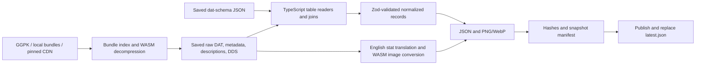

# Local game-data pipeline

Extract PoE 1 and PoE 2 client assets into separate, versioned datasets of item bases, modifiers, ordered weight rules, stats, tags, item classes, English modifier text, and PNG/WebP inventory images. Inputs can be an installed game (`Content.ggpk` or `Bundles2`), previously extracted raw files, or GGG's patch CDN. No account or website scraping is needed.

The implementation is TypeScript with shared Zod schemas. It uses `pathofexile-dat` for bundle/DAT decoding, its `ooz-wasm` dependency for decompression, and `@imagemagick/magick-wasm` for images. GGPK access, joins, item metadata, stat-description translation, validation, and snapshot management live in this package. Python, uv, native compiler toolchains, and an external ImageMagick installation are no longer required.

The [research report](../../docs/research/poe-game-data-extraction.md) explains GGPK, the extraction tools, and the evidence for PoEDB and Craft of Exile's data sources. The JSON contract and curated release states follow [RePoE](https://github.com/repoe-fork/repoe); see [third-party notices](THIRD_PARTY_NOTICES.md).

## Run it

Install [Vite+](https://viteplus.dev/guide/) and the Node version in `.node-version` (Node 24). From the repository root:

```sh
vp install --frozen-lockfile
vp run @poe-tools/game-data#test
vp run @poe-tools/game-data#extract versions
vp run @poe-tools/game-data#extract run --config pipeline.example.json
```

Vite+ runs this package's scripts from `packages/poe-game-data`, so command paths and the default `data/` output are relative to that directory. `versions` performs a read-only handshake with GGG's patch servers. Copy its result into a config before a new extraction. The example pins the builds verified on 2026-10-02; old CDN versions can disappear.

Append `--game poe1` or `--game poe2` to select one game. The default processes every configured game, in order. After extraction succeeds for all selected games, `run` updates their tracked data packages. A failure stops the command; a game already published keeps its snapshot. Progress goes to stderr; snapshot paths and package results are JSON on stdout. Bundles download on demand and are cached by game and patch under `.cache/bundles/`. Allow several gigabytes of disk space for cached bundles, raw assets, and images.

## Use an installed game or saved raw files

Create ignored `pipeline.local.json` in this package:

```json
{
    "poe1": { "patch": "3.29.3.3", "directory": "F:/Games/Path of Exile" },
    "poe2": { "patch": "4.5.5.4", "directory": "F:/Games/Path of Exile 2" }
}
```

```sh
vp run @poe-tools/game-data#extract run --config pipeline.local.json
```

Use the installation root containing `Content.ggpk` or `Bundles2/_.index.bin`, not the archive filename or `Bundles2` directory itself. An unpacked directory with logical `Data`, `Metadata`, and `Art` paths also works. Directory paths resolve relative to the config file. The source is read-only; keep the patcher closed during extraction so inputs remain consistent.

For local sources, `patch` is your label, not a version verified from the archive. Use the full client build/CDN version from the game's log, which can differ from the public patch name.

The default schema downloads from [poe-tool-dev/dat-schema's latest release](https://github.com/poe-tool-dev/dat-schema/releases). To match an older client or work offline, supply `--schema path/to/schema.json`. The schema is a community interpretation of binary records. A row-size mismatch stops extraction rather than guessing offsets. Schema formats 7 and 8 are supported; a newer format needs an explicit compatibility review.

## Architecture



| Module | Responsibility |
| --- | --- |
| `config.ts`, `versions.ts` | Validate game/build selection; discover versions via the patch protocol |
| `ggpk.ts`, `source.ts` | Read GGPK, resolve bundle slices, cache downloads, record input hashes |
| `dat-reader.ts`, `tables.ts` | Decode DAT columns, enforce row sizes, resolve foreign keys |
| `metadata.ts`, `normalize.ts` | Inherit item tags; join bases, requirements, properties, classes, modifiers, and stats |
| `translations.ts` | Parse English descriptions, includes, conditions, numeric handlers, and relational values |
| `images.ts` | Resolve DDS aliases/Brotli, export PNG/WebP, compose PoE 2 flask icons |
| `model.ts` | Canonical Zod data contract, relationship validation, diagnostic mod pools |
| `pipeline.ts`, `cli.ts`, `distribute.ts` | Record provenance, publish, verify, replay, inspect, generate packages, and optionally commit |

PoE 1 tables live at `Data/*.datc64`; PoE 2 uses `Data/Balance/*.datc64`. PoE 1 stat descriptions are `Metadata/StatDescriptions/*.txt`. PoE 2 uses `Data/StatDescriptions/*.csd`: these are UTF-16LE text and use the same description parser. Both games keep inherited item tags in `.it` files.

The decoder is pinned to `pathofexile-dat` 15.2.0. Its public DAT barrel initializes a browser analysis WASM module through `fetch(file:)`, which Node does not support. `dat-reader.ts` imports only the installed decoder/header/field-reader modules. This isolates the compatibility workaround; changing the dependency version requires testing that adapter. WASM decompression and image conversion load locally and do not require runtime network access.

Each consumed logical file is saved under `raw/`, with SHA-256 and byte count in `inputs.json`. `transport.json` records the compressed index/bundles or loose source files. The exact schema, pipeline sources, package metadata, workspace catalog, and dependency lock are saved with every snapshot.

Zod validates the shared normalized contract, including stat ranges and weight values. The pipeline checks paired tag/weight-array lengths, DAT row sizes, references it resolves, and normalized base/class/implicit/stat/weight-tag relationships. Missing text and images are reported separately; unused records can legitimately have neither text nor a positive spawn weight.

A successful run renames its staging directory, then atomically replaces the game's `latest.json`. Failed extraction retains `.incomplete-*` evidence and `extract.log` without advancing the pointer. Publication is independent for each game.

## Outputs and inspection

```text
data/<game>/
  latest.json
  snapshots/<patch>-<run-id>/
    manifest.json                     # format 2, game, patch, source and hashes
    config.json / schema.json
    pipeline/src/...                  # pipeline source at invocation
    pipeline/package.json
    pipeline/pnpm-lock.yaml / pnpm-workspace.yaml
    inputs.json / transport.json
    validation.json
    translation-errors.json / image-errors.json
    raw/Data/... / raw/Metadata/... / raw/Art/...
    normalized/base_items.json
    normalized/mods.json
    normalized/stats.json
    normalized/tags.json
    normalized/item_classes.json
    normalized/Art/...                # PNG and WebP
```

Outputs retain the existing snake_case JSON contract, compact `.min.json` variants, per-class base files, tag details, and parsed item metadata. Base keys are metadata paths; mod keys are raw modifier IDs. Replace `.dds` in `visual_identity.dds_file` with `.png` or `.webp` under `normalized/` for display.

Resolve the actual snapshot path in PowerShell from the repository root:

```powershell
$pointer = Get-Content packages/poe-game-data/data/poe1/latest.json | ConvertFrom-Json
$snapshot = "data/poe1/$($pointer.snapshot)"
vp run @poe-tools/game-data#extract verify --snapshot $snapshot
vp run @poe-tools/game-data#extract inspect --snapshot $snapshot --base Metadata/Items/Belts/Belt3 --item-level 85
```

`verify` checks file hashes and normalized relationships, including missing or unrecorded files. These local hashes detect changes; they do not authenticate the publisher. `extract.log` is excluded from hashing. `inspect` returns the base and eligible prefixes/suffixes with selected client weights. Repeat `--existing ModId` to incorporate added tags and exclusion groups.

The diagnostic pool respects domain, minimum/maximum level, essence-only status, groups, and ordered tag rules. The first matching spawn tag wins, including zero; the first matching generation weight is a percentage multiplier, defaulting to 100. No matching spawn rule means zero. This is not a complete crafting simulator: rarity/affix caps, influences, fossils, bench recipes, omens, and method-specific probabilities need separate logic.

**PoE 2 client values are not Craft of Exile's relative weight estimates.** Build `4.5.5.4` has 17,058 spawn-weight entries: 9,125 zeros and 7,933 ones. These values provide eligibility without unequal weighting among eligible mods. The manifest and inspection output identify that provenance. Craft of Exile documents its [empirical weighting methodology](https://www.craftofexile.com/weightings?game=poe2) separately.

## Offline replay and migration

```sh
vp run @poe-tools/game-data#extract replay --snapshot data/poe1/snapshots/<patch>-<run-id>
```

Replay verifies the original snapshot and requires the current pipeline source, package metadata, catalog, and dependency lock to match its fingerprint. It then runs against saved raw assets and the saved schema. With dependencies already installed, replay makes no network requests. Restore the recorded repository revision and use `vp install --frozen-lockfile` before going offline. A root lockfile change, even outside this package, intentionally invalidates the fingerprint.

The former Python format-1 snapshots remain useful raw inputs, but are not accepted by format-2 `verify` or `replay`. To migrate one, configure `directory` as its `raw/` directory, retain its game and patch, and run with `--schema <old-snapshot>/schema.json`. The new snapshot records the TypeScript implementation and lock. Do not overwrite the old snapshot.

Keep this extractor's `data/` while you need its provenance and replay inputs. `.cache/` is disposable; clearing it causes CDN downloads again. Both directories and `pipeline.local.json` are ignored. Normalized JSON is also copied into tracked sibling packages. A CDN 404 can mean a retired patch; choose a new explicit version or a saved source. The pipeline never silently switches patches.

## Committed data packages

`run` writes the normalized JSON and standalone TypeScript/Zod schemas to `@qcksys/poe-1-data` and `@qcksys/poe-2-data`. Versions derive from exact client build IDs: `3.29.3.3` becomes `3.29.3-build.3`, and `4.5.5.4` becomes `4.5.5-build.4`. Add `--commit` to create a scoped local Git commit. Use `package --snapshot <path>` to regenerate from saved inputs, or `verify-packages` to check committed data without raw snapshots. See the [distribution guide](DISTRIBUTION.md) for commands, version rules, integrity checks, and local tarballs.

## Verification and compatibility

The TypeScript pipeline was verified on Windows with saved client assets from these builds:

| Game / build | Bases | Mods | Stats | Tags | Mods without text | Missing base images |
| --- | ---: | ---: | ---: | ---: | ---: | ---: |
| PoE 1 / `3.29.3.3` | 5,461 | 40,355 | 23,346 | 1,389 | 3,952 | 0 |
| PoE 2 / `4.5.5.4` | 5,496 | 16,784 | 27,281 | 1,339 | 3,420 | 0 |

Both patch handshakes and direct bundle extraction of `BaseItemTypes` were also checked against GGG. Offline replay with `fetch` disabled reproduced all 6,588 PoE 1 and 5,872 PoE 2 normalized files byte-for-byte, including PNG and WebP. PNG output excludes ImageMagick's volatile date/time metadata. No installed archive was supplied: GGPK coverage uses synthetic UTF-16/UTF-32 fixtures and verifies read-only behavior. CI validates offline pipeline fixtures and every committed package JSON file without downloading game assets.

An optional full-reference test compares every normalized record with the prior RePoE/PyPoE export. It preserves three reviewed corrections: production text renders all eight stat slots instead of six; the PoE 2 gold join resolves values (for example `Strength1 = 134`); signed Ultimatum hashes resolve correctly and unresolved passive references use a descriptive placeholder instead of `[]`. The reference comparison restricts text to six stats to test legacy parity, while separate fixtures require all eight in production translation.

The checked Leather Belt (`Metadata/Items/Belts/Belt3`) has drop level 10, dimensions 2×1, `belt/default` tags, and implicit `IncreasedLifeImplicitBelt1` (+25–40 life), matching [PoEDB](https://poedb.tw/us/Leather_Belt) and [Craft of Exile](https://beta.craftofexile.com/data?mode=items&dataItemSearchInput=Leather+Belt). `IncreasedLife1` has level 5, life range 10–24, and ordered weights `fishing_rod:0`, `weapon:0`, `default:1000`, matching [CoE's metadata](https://beta.craftofexile.com/data?mode=mods&dataModSearchInput=IncreasedLife1). These are sample checks, not claims of complete website equivalence. PoE 2's same mod ID instead means level 1, life 10–19, and eligible class weights of 1.

Run the optional integration checks from the repository root (the snapshot environment path resolves from this package):

```powershell
$env:POE_REFERENCE_SNAPSHOT = "path/to/old-snapshot"
$env:POE_REFERENCE_GAME = "poe1"
vp run @poe-tools/game-data#test
Remove-Item Env:POE_REFERENCE_SNAPSHOT, Env:POE_REFERENCE_GAME
$env:POE_CDN_PATCH = "4.5.5.4"
vp run @poe-tools/game-data#test tests/cdn.test.ts
Remove-Item Env:POE_CDN_PATCH
```

After schema/dependency changes, run the fixture suite, type checking, extraction for both games, verification/replay, and the reference comparison. Review missing text/images and sample website records. Translation failures are recorded per modifier, so a future unsupported handler does not invent display text. Curated release states are interpretations inherited from RePoE, not proof an item is currently obtainable.

TypeScript fits the joins, validation, CLI, and shared app contract. Keep binary decompression and image codecs in maintained WASM dependencies; consider Rust only if profiling or format-support requirements justify replacing those components.
